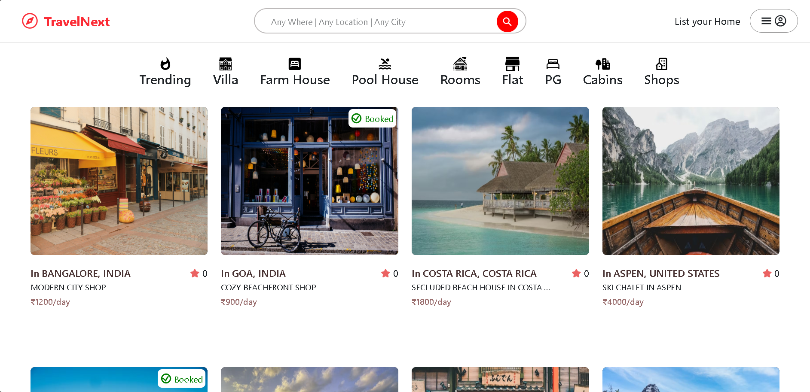

# 🧭 TravelNext - To Add & Booking listings

_**TravelNext** is a **web application** to add **listings** and **Booking listings**. If you booked the listing then you see the booked listing in booked section._

---

## 📌 Table of Contents

- <a href="#overview">Project Overview</a>
- <a href="#problem">Project Problems</a>
- <a href="#aim">Aim of the Project</a>
- <a href="#tools--technologies">Tools & Technologies</a>
- <a href="#project-structure">Project Structure</a>
- <a href="#key-features">Key Features</a>
- <a href="#home">Home Page</a>
- <a href="#how-to-run-this-project">How to Run This Project</a>
- <a href="#api-endpoints">API Endpoints</a>
- <a href="#future-enhancements">Future Enhancements</a>
- <a href="#author--contact">Author & Contact</a>

---

<h2><a class="anchor" id="overview"></a>🔗 Project Overview</h2>

**TravelNext** is a modern full-stack **Airbnb-style web application** built with the **MERN stack.** The platform allows users to explore, book, and manage various types of accommodations such as rooms, villas, shops, and pool houses, ...etc with secure authentication and image uploads.

---

<h2><a class="anchor" id="problem"></a>🔗 Project Problems</h2>

Finding and booking accommodations online often involves multiple challanges such as limited filtering options, lack of transparent information, insecure authentication, and poor user experience.

---

<h2><a class="anchor" id="aim"></a>🔗 Aim of the Project</h2>

The key objectives of this project are:

- To provide a platform where users can browse accommodations by categories such as rooms, villas, shops and pool houses.
- To implement secure user authentication using **JWT** and **bcrypt**.
- To allow users to add, edit, delete, and update listings.
- To develop a booking system for listings.

---

<h2><a class="anchor" id="tools--technologies"></a>🔗 Tools & Technologies</h2>

### Frontend

- **React.js**
- React Router DOM
- Axios
- CSS & Tailwind CSS

### Backend

- **Node.js**
- **Express.js**

### Database

- **MongoDB** with Mongoose

### Authentication & Storage

- **JWT** - authentication
- **bcrypt** - password encryption
- **Cloudinary** - image upload & storage

---

<h2><a class="anchor" id="project-structure"></a>🔗 Project Structure</h2>

```
travelNext/
├── frontend/
│   ├── node_modules/
│   ├── public/
│   ├── src/
│   │   ├── assets/
│   │   ├── components/
│   │   ├── context/
│   │   ├── Home/
│   │   ├── pages/
│   │   ├── App.jsx
│   │   ├── index.css
│   │   └── main.jsx
│   ├── .gitignore
│   ├── eslint.config.js
│   ├── index.html
│   ├── package-lock.json
│   ├── package.json
│   ├── README.md
│   └── vite.config.js
│
├── backend/
│   ├── config/
│   ├── controller/
│   ├── jwt/
│   ├── middleware/
│   ├── models/
│   ├── node_modules/
│   ├── public/
│   ├── routes/
│   ├── .env
│   ├── .gitignore
│   ├── index.js
│   ├── package-lock.json
│   └── package.json
│
└── README.md
```

---

<h2><a class="anchor" id="key-features"></a>🔗 Key Features</h2>

### Authentication & Security

- User **Signup, Login, Logout**
- **JWT-based authentication**
- Secure password hashing using **bcrypt**

### Listing Management

- Create new listings
- Edit existing listings
- Delete listings
- Upload multiple images via **Cloudinary**

### Booking System

- Book available listings
- View booking history

---

<h2><a class="anchor" id="home"></a>🔗 Home Page</h2>

- TravelNext Home page shows:
  - Display a Navbar
  - Different types of categories
  - View the listing
  - Show the listing are booked or not



---

<h2><a class="anchor" id="how-to-run-this-project"></a>🔗 How to Run This Project</h2>

1. Prerequisites

- Node.js
- MongoDB
- npm

2. Clone the Repository:

```Bash
git clone https://github.com/yourusername/TravelNext.git
cd TravelNext
```

3. Backend Setup

```Bash
cd backend
npm install
npm start
```

4. Create a `.env` file inside `backend/`:

```
MONGO_URL = your_mongodb_connection_string
SERVER_PORT = your_server_port
JWT_SECRET = your_jwt_secret
CLOUDINARY_CLOUD_NAME = your_cloudinary_name
CLOUDINARY_API_KEY = your_cloudinary_api_key
CLOUDINARY_API_SECRET = your_cloudinary_api_secret
```

5. Frontend Setup

```Bash
cd frontend
npm install
npm run dev
```

---

<h2><a class="anchor" id="api-endpoints"></a>🔗 API Endpoints</h2>

### User Routes

- `GET /api/user/currentuser` - Gives Current User
- `POST /api/user/signup` - Signup
- `POST /api/user/login` - Login
- `POST /api/user/logout` - Logout

### Listing Routes

- `GET /api/listing/get` - Get all listings
- `GET /api/listing//findlistingbyid/:id` - Find listing By Id
- `GET /api/listing/search` - To Search listing
- `POST /api/listing/add` - Add listing
- `POST /api/listing/ratings/:id` - Ratting listing
- `POST /api/listing/update/:id` - Update listing
- `DELETE /api/listing/delete/:id` - Delete listing

### Booking Routes

- `POST /api/booking/create/:id` - Create booking
- `DELETE /api/booking/cancel/:id` - Cancel booking

---

<h2><a class="anchor" id="future-enhancements"></a>🔗 Future Enhancements</h2>

- Payment integretion
- Wishlist/Favourite
- Admin dashboard

---

<h2><a class="anchor" id="author--contact"></a>🔗 Author & Contact</h2>

**Prahlad Agarwal**

📧 Email: prahladagarwal575@gmail.com  
🔗 Live Preview: https://travelnext-frontend-folder-rvvm.onrender.com  
🔗 GitHub: https://github.com/prahlad-agarwal/TravelNext
